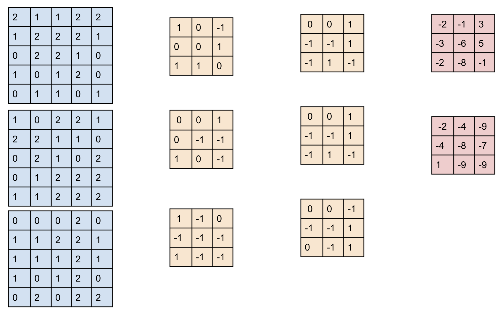

# Convolution-optimization

 
This document explains an optimized implementation of convolution function built on what was Implemented on CMSIS. We then  Analyzed the code and thought of ways to accelerate through hardware units.

Explanation of convolution:
 First of all, convolution is one of the most important functions in Neural Networks. Convolution is the process of applying a filter to an image inorder to produce a feature map that indicates the presence of detected features.

Let's consider we have an input image of only one channel of size 5x5 and a filter of size 3x3 with stride length 1. The filter will be passed  through the image with stride of 1 to compute feature map thus it will be calculated as the following

 

                            
 
     
The same is applied for images of channels greater than 1 and more than one filter. In general, each filter has channels equal to the input channels. The channels of the output features map is equal  to the number of filters.
 
 
# General Implementation of convolution:

 

This part explains the general implementation of convolution function, how to pass input and the flow of the code.
There are 6 nested for loops, the first outer loop loops over the number of filters which is the number of the output channels, the following two loops loop over the y and x dimensions of the output respectively. The fourth and fifth loops loop over the y and x dimensions of the filter and the last loop loops over the number of input channels. In the inner loop the weight of the input image is multiplied by the weights of the kernel and added to the variable conv_out  which is assigned to the output matrix at the end of one iteration.
The input parameters:
The input matrix of Im_in contains the values of the image matrix of all the channels while the wt contains the weights of the kernels. The input is passed as an element from the first channel followed by an element of the second, then third and so on.
For instance in the example above, The Im_in matrix will be as the following: {2,1,0,1,0,0,1,2,0,2,2,2,2,1,0,....}  while the wt = {1,0,1,0,0,-1,-1,1,0,....}.
 
# Optimized Implementation of convolution:
The optimized implementation is based on what was implemented on CMSIS with some modifications as to be accelerated on a specific hardware. The HWC convolve function is firstly called with the inputs. There are four nested for loops: the outer loops loop over the x and y dimensions of the output matrix while the inner loops loop over the x and y dimension of the kernel. For every two strides, the mat-mult function is called and the pbuffer with weights of two strides are passed. 
In the mat_mult function, matrix multiplication is applied, __SMLAD_4Ux8bits
 function is used to imitate a unit composed of four parallel multiples and a unit of 8-bits. This implementation will be found in cmsis_convolve_v2.cpp in the sources directory
 
 
 
 
 
 
